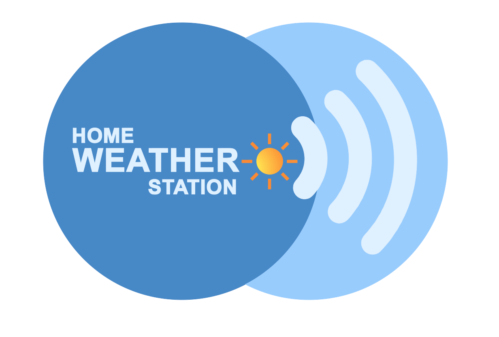

# Home Weather Station

This is a fork of Steven Estrella's original work, that you can [see here](https://css-tricks.com/how-i-built-a-gps-powered-weather-clock-with-my-old-iphone-4/).

The difference between the above and my fork is essentially:
## Features
* Multilingual support
* Units formating
* Using SVG instead of raster images
* Supports the Beaufort scale
* Weather conditions is represented better with animation of the background layers

## Demo
It can bee seen running at [my own site](https://varoystrand.se/weather/)

## Todo
Other then the above I'm planing on extending it further with some photography related info:
* Moonrise
* Moonset
* Morning golden hour end
* Evening golden hour start
* Moon phases
* Make it a [Koken plugin](https://kokensupport.com)

## Credits
* [Steven Estrella](https://www.shearspiremedia.com) for he's initial work
* Jhey for his work on [Starry Sky Generator](https://codepen.io/jh3y/pen/XoXgPP)
* Chris Coyier for creating [Sky gradients](https://codepen.io/chriscoyier/pen/xjgdG)
* Jerry Jones for he's Pen [Night Sky](https://codepen.io/jeryj/pen/YqyaJJ)
* Codeconvey for there Pen [CSS Snow Animation Effect](https://codepen.io/codeconvey/pen/xRzQay)

There are probably a bunch of people that I have missed right of the batt, but when I get reminded I'll add them to the list ;)
